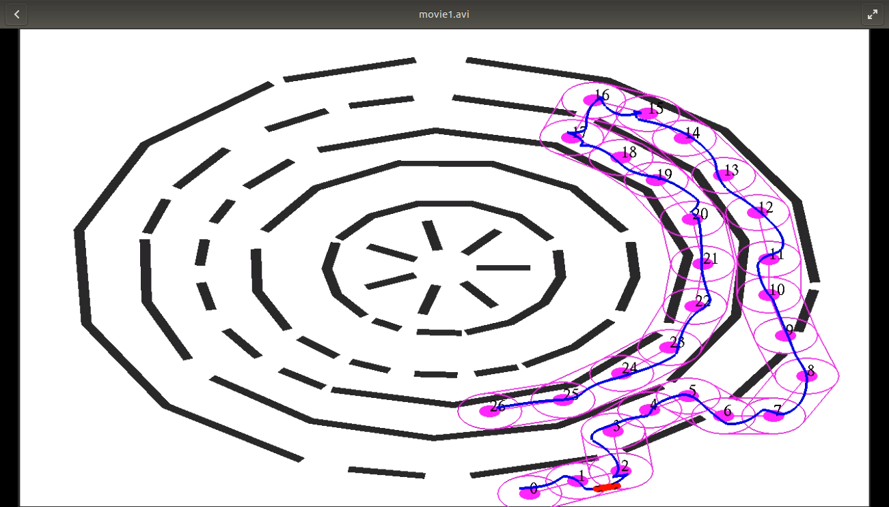

# MotionPlanningRobotFollowWaypoints
Motion Planner algorithm for car robot to reach a set of waypoints.
Inline-style:


## How to use
```
cmake -DCMAKE_BUILD_TYPE="Release"
make
./bin/Runner GRunFollowPlanner data/paperScene1Params.txt
```
Specify the path that needs to be followed by clicking the mouse. Each click defines a waypoint. The path is then defined as the sequence of waypoints. Make sure that the first circle includes the car. The lines in magenta show the tubes where the solution needs to stay (planner rejects vertices outside the tubes). The filled circle in magenta shows the acceptable distance to reach the corresponding waypoint.

After you have specified the path, press 'r' to run the planner.
